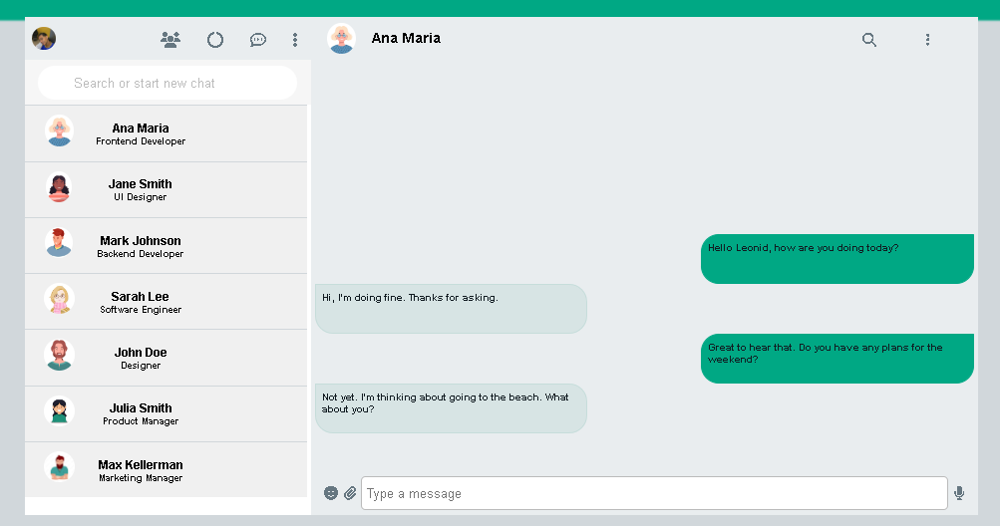

# 
<h1>WhatsApp</h1> 

|      DESKTOP        |
|:-------------------:|
|

## [Clique aqui](https://lucasvinip.github.io/whatsApp-senai-1-2023/ds2m/lucas_vinicius_pereira_da_silva/) para acessar o site

-----

# **Sobre**

Este projeto foi concebido pelo professor de Programação Web Front-End, com o objetivo de desenvolver um website interativo que obtenha seus dados a partir de um arquivo JSON.

# **To Do List:**

- Consumir dados de um JSON
- Desenvolver o esquelo no estilo WhatsApp

# **Tecnologias Aplicadas**

- HTML5
- CSS3
- JAVASCRIPT

# **Ferramentas**

| NOME                                                                                                                                                                                   |                                               GITHUB                                               |                                       FOTO                                        |
| :----------------------------------------------------------------------------------------------------------------------------------------------------------------------------------------- | :------------------------------------------------------------------------------------------------: | :-------------------------------------------------------------------------------: |
|  |      | </a> |